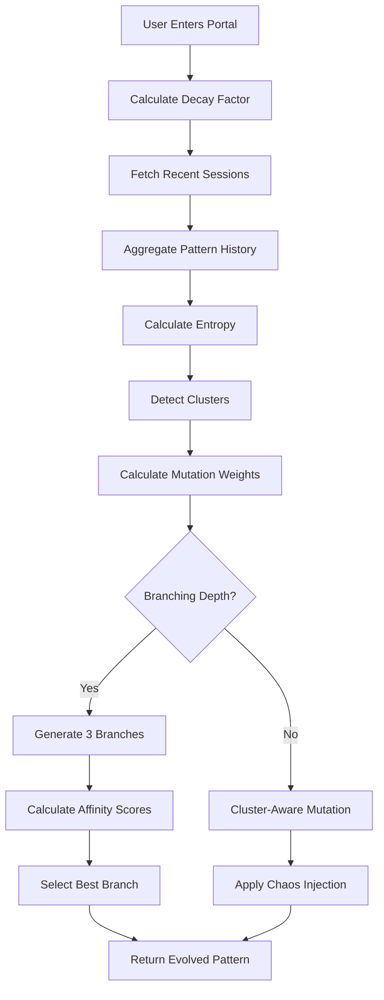

# RECURSOR — Architecture & Vocabulary

## Phase 0: Foundation Stabilization ✅

This document defines the core architecture, data structures, and vocabulary that powers RECURSOR's recursive experience engine.

---

## 📐 Core Vocabulary

### Pattern
A **Pattern** is a linear sequence of cells representing the current puzzle state.
- Type: `number[]` (array of integers)
- Each value represents a cell's evolution state (0-3)
- Patterns evolve through user interaction and historical analysis
- Patterns are always flat arrays for consistency and predictability

**Example:**
```typescript
const pattern: Pattern = [0, 1, 2, 1, 0, 1, 2, 3, 0];
```

### Cell
A **Cell** is a single interactive unit within a pattern.
- Each cell has a state (0-3) representing its evolution level
- States:
  - `0` = Empty/dormant
  - `1` = Awakening  
  - `2` = Active
  - `3` = Complete/mature (triggers portal when all cells reach this)

**Visual representation:**
- State 0: `○` (empty circle)
- State 1: `●` (one filled dot)
- State 2: `●●` (two filled dots)
- State 3: `●●●` (three filled dots + fractal corner markers)

### Depth
**Recursion Depth** tracks how many recursive layers deep the user has descended.
- Type: `number`
- Starts at 0, increases by 1 with each portal entry
- Affects visual presentation (color shifts, particle effects)
- Affects pattern evolution logic

### Branch
A unique path through the recursion tree.
- Currently linear (single path)
- Reserved for future multi-path recursion feature
- Will enable divergent experiences based on choices

### Node
A single point of interaction in the recursion tree.
- Represents a decision or mutation event
- Actions: `pattern-mutation`, `portal-entry`, `session-start`, `session-complete`

### Memory (Session)
A completed recursive session stored in IndexedDB.
- Represents the user's journey through one complete recursion cycle
- Includes metadata: duration, interaction count, unique patterns
- Used for pattern evolution and constellation visualization

---

## 🗂️ Data Structures

### RecursionSession
```typescript
interface RecursionSession {
  id?: number;                  // Auto-generated by IndexedDB
  timestamp: number;            // Session start time (ms)
  depth: RecursionDepth;        // Max depth reached
  decisions: string[];          // Log of user decisions
  patterns: number[];           // Flattened history of all pattern states
  completed: boolean;           // Whether session reached completion
  metadata: SessionMetadata;    // Performance metrics
}
```

### SessionMetadata
```typescript
interface SessionMetadata {
  duration: number;             // Total session time (ms)
  interactionCount: number;     // Number of cell selections
  uniquePatterns: number;       // Unique pattern states encountered
}
```

### SessionStats
```typescript
interface SessionStats {
  totalSessions: number;        // Total sessions recorded
  avgDepth: number;             // Average recursion depth
  maxDepth: number;             // Deepest recursion reached
  completionRate: number;       // % of completed sessions (0-1)
  oldestSession: number | null; // Timestamp of first session
}
```

---

## 🏗️ System Architecture

### Core Files

#### `src/lib/types.ts`
Central type definitions and vocabulary documentation.
- Exports all core types and interfaces
- Single source of truth for data structures
- Heavily documented with JSDoc comments

#### `src/lib/constants.ts`
Immutable configuration values.
- Pattern constants (initial pattern, cell states, completion threshold)
- Visual constants (colors, animations, transitions)
- Session constants (evolution history size)

#### `src/lib/recursionDB.ts`
IndexedDB persistence layer.
- Manages session storage and retrieval
- Session analytics calculations
- Pattern evolution engine

### Component Structure

```
src/
├── components/
│   ├── RecursiveEngine.tsx      # Main orchestrator
│   ├── PatternGrid.tsx          # Interactive cell grid
│   ├── RecursionPortal.tsx      # Portal entry animation
│   └── MemoryConstellation.tsx  # Session visualization
├── pages/
│   ├── Index.tsx                # Entry page
│   └── Memory.tsx               # Memory viewer page
└── lib/
    ├── types.ts                 # Type definitions
    ├── constants.ts             # Configuration
    └── recursionDB.ts           # Database layer
```

---

## 🔄 Core Systems

### 1. Pattern Evolution Engine
**Location:** `src/lib/recursionDB.ts`

**Purpose:** Mutate patterns based on user's historical behavior.

**Algorithm:**
1. Fetch last 5 sessions from IndexedDB
2. Extract all pattern states from those sessions
3. Calculate mutation index using deterministic formula:
   ```typescript
   mutation = sessions
     .flatMap(s => s.patterns)
     .reduce((acc, val) => acc + (val % 3), 0) % currentPattern.length
   ```
4. Increment the cell at that index (wraps at 3 → 0)
5. Return evolved pattern

**Result:** Seemingly "intelligent" evolution that reflects user behavior without being obvious.

### 2. Session Tracking
**Location:** `src/components/RecursiveEngine.tsx`

**Flow:**
1. `initSession()` - Create new session record
2. `handlePatternChange()` - Log each cell mutation
3. `handleEnterPortal()` - Trigger depth increase
4. `handleReset()` - Mark session complete, start new one

**Persistence:** All sessions stored in IndexedDB for later analysis.

### 3. Completion Detection
**Location:** `src/components/RecursiveEngine.tsx`

**Logic:**
```typescript
const isComplete = pattern.every(v => v >= COMPLETION_THRESHOLD);
```

**Behavior:**
- Portal appears when all cells reach state 3
- User can choose to descend deeper or reset
- Depth increases with each descent

### 4. Memory Visualization
**Location:** `src/components/MemoryConstellation.tsx`

**Layout:**
- Sessions arranged in circular constellation
- Node size = depth + interaction count
- Node color = depth-based hue shift
- Opacity = completion status (1.0 if complete, 0.5 if incomplete)
- Connecting lines between sequential sessions

---

## 🎨 Visual System

### Color Algorithm
```typescript
const hue = BASE_HUE + depth * HUE_SHIFT_PER_DEPTH;
// BASE_HUE = 180 (cyan)
// HUE_SHIFT_PER_DEPTH = 30
// Depth 0: cyan (180°)
// Depth 1: blue (210°)
// Depth 2: purple (240°)
// Depth 3: magenta (270°)
// etc.
```

### Animation Timings
- Portal transition: 1000ms
- Cell reveal: 50ms per cell (staggered)
- Completion detection: immediate
- Portal pulse: 2000ms cycle

---

## 📊 Key Constants

| Constant | Value | Purpose |
|----------|-------|---------|
| `INITIAL_PATTERN` | `[0,1,2,1,0,1,2,3,0]` | Starting pattern for all sessions |
| `CELLS_TO_SELECT` | `3` | Number of cells to trigger mutation |
| `MAX_CELL_STATE` | `3` | Maximum cell value before wrap |
| `COMPLETION_THRESHOLD` | `3` | Cell state needed for completion |
| `BASE_HUE` | `180` | Starting color (cyan) |
| `HUE_SHIFT_PER_DEPTH` | `30` | Color shift per depth level |
| `EVOLUTION_HISTORY_SIZE` | `5` | Sessions analyzed for evolution |

---

## 🧹 Removed Code (Phase 0 Cleanup)

### Deleted Interfaces/Types
- ❌ `MemoryNode` - Was defined but never used

### Deleted Functions
- ❌ `pulsePhase` in `RecursionPortal` - Set but never read

### Deleted Database Tables
- ❌ `memories` table - Was created but never populated

---

## 🧠 Phase 1: True Recursive Mutation (The Engine Brain)

### Non-Linear Mutation Engine

The mutation engine (`src/lib/mutationEngine.ts`) transforms RECURSOR from "UI with memory" to "recursive logic system."

#### Core Algorithms

**1. Entropy Analysis**
- Calculates Shannon entropy: `-Σ(p * log₂(p))`
- Range: 0 (pure order) to 2 (pure chaos)
- Used to determine mutation strategy:
  - High entropy → preserve chaos
  - Low entropy → break patterns

**2. Cluster Detection**
- Identifies repeated sequences in patterns
- Detects structure: `[1,2,1,2]` has cluster `[1,2]` appearing 2x
- Cluster density: 0 (no structure) to 1 (highly structured)
- Strategy:
  - High density → disrupt clusters
  - Low density → preserve randomness

**3. Mutation Weights**
Calculated from multiple factors:
```typescript
strength = depthWeight × entropyWeight × decayWeight
chaos = (1 - decayFactor) × 0.3 + (depth × 0.05)
```

- **Depth Weight**: 1 + (depth × 0.2), max 2.5
- **Entropy Weight**: 1 + (0.5 - normalizedEntropy)
- **Cluster Weight**: 1 + (clusterDensity × 0.3)
- **Decay Weight**: decayFactor (0.3-1.0)

**4. Branching Evolution**
- Activates every 3 depths (depth % 3 === 0)
- Generates 2-3 possible pattern evolutions
- Each branch applies different mutation intensities
- Selection uses "affinity" to recent patterns:
  - Rewards `diff === 1` (similar but different) most
  - Rewards `diff === 0` (identical) least
  - Selects deterministically from top 80% affinities

**5. Cluster-Aware Mutation**
Two strategies:
- **Preserve**: Mutate only non-cluster cells
- **Disrupt**: Target cluster cells specifically

Applied based on cluster density threshold (0.5).

**6. Chaos Injection**
When `chaos > 0.2`:
- Applies random-feeling mutations
- Actually deterministic (based on pattern state)
- Amount scales with chaos level

#### Decay System

**Purpose**: Time-based influence on pattern evolution

**Formula**: 
```typescript
decay = Math.exp(-0.1 × daysSince)
clamped between 0.3 and 1.0
```

**Behavior**:
- Fresh session: decay = 1.0 (full influence)
- 7 days old: decay ≈ 0.5 (half influence)
- Never below 0.3 (memories persist but fade deeper)

**Effect on Mutations**:
- High decay (fresh) → predictable evolution
- Low decay (old) → more chaotic evolution
- Updates on each portal entry

#### Visual Feedback

**Depth Indicator Enhanced**:
Shows real-time mutation state:
- Entropy level (0-1)
- Cluster count
- Chaos percentage
- Branching warnings

**Branching Points**:
When depth + 1 is divisible by 3:
```
⚠ BRANCHING POINT DETECTED ⚠
```

### Key Files

**`src/lib/mutationEngine.ts`**
- 500+ lines of mutation logic
- Exported functions:
  - `calculateEntropy()`
  - `detectClusters()`
  - `calculateMutationWeights()`
  - `generateBranches()`
  - `selectBranch()`
  - `mutateWithClusters()`
  - `evolvePattern()` (main)
  - `analyzePattern()` (diagnostic)

**`src/lib/recursionDB.ts`**
- Wrapper function `evolvePattern()` 
- Aggregates session history
- Calculates average decay factor
- Calls mutation engine with context

**`src/components/RecursiveEngine.tsx`**
- Integrates mutation engine
- Updates decay on portal entry
- Enables branching at correct depths
- Displays mutation stats

### Tuning Parameters

Balance between chaos and order:

| Parameter | Value | Effect |
|-----------|-------|--------|
| `decayRate` | 0.1 | Decay speed per day |
| `minDecay` | 0.3 | Minimum influence (deeper fade) |
| `depthMultiplier` | 0.2 | Depth → mutation strength |
| `maxDepthWeight` | 2.5 | Maximum depth amplification |
| `chaosBase` | 0.3 | Base chaos from decay |
| `chaosDepthRate` | 0.05 | Chaos increase per depth |
| `branchingInterval` | 3 | Depths between branching |
| `branchCount` | 2-3 | Evolutions per branch |
| `affinityThreshold` | 0.8 | Top % for branch selection |

### Pattern Evolution Flow



---

## 🔮 Future Architecture Notes

### Branching System (Phase N)
When implementing branching:
1. Activate `Branch` interface in `types.ts`
2. Store branch relationships in new `branches` table
3. Update `RecursiveEngine` to track branch IDs
4. Create branch visualization in constellation

### Matrix Grid (Potential)
If pattern structure needs to become 2D:
1. Change `Pattern` from `number[]` to `number[][]`
2. Update `PatternGrid` rendering logic
3. Adjust evolution algorithm for 2D traversal
4. Maintain backward compatibility via migration

### Memory Decay (Future)
If re-implementing decay:
1. Add `lastAccessed` field to `RecursionSession`
2. Restore `calculateDecay()` function
3. Apply decay factor to visualization opacity
4. Run decay calculation on app load

---

## ✅ Phase 0 & 1 Deliverables Complete

### Phase 0: Foundation ✅
- ✅ Pattern data structure finalized (flat array)
- ✅ Cell concept clearly defined (0-3 states)
- ✅ Unused variables cleaned up (MemoryNode, pulsePhase)
- ✅ Recursion vocabulary documented
- ✅ Type system centralized in `types.ts`
- ✅ Constants extracted to `constants.ts`
- ✅ All code commented with clear intent

### Phase 1: Mutation Engine ✅
- ✅ Non-linear mutation engine implemented
- ✅ Entropy calculation (Shannon entropy)
- ✅ Cluster detection (repeated sequences)
- ✅ Decay factor system (time-based influence)
- ✅ Depth-weighted mutations
- ✅ Branching evolution (every 3 depths)
- ✅ Mutation weights (strength + chaos)
- ✅ Visual feedback (entropy, clusters, chaos %)
- ✅ Cluster-aware mutation strategies

**Foundation Status:** 🟢 STABLE
**Mutation Engine Status:** 🟢 OPERATIONAL

Ready for Phase 2+ features (audio, achievements, export visualizations, etc.).
